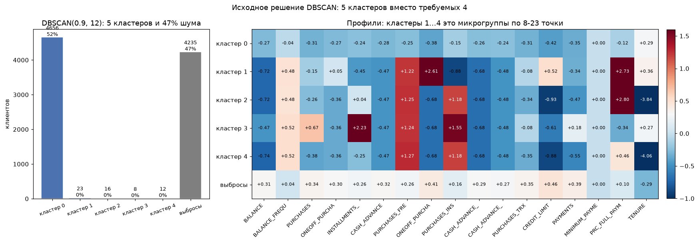
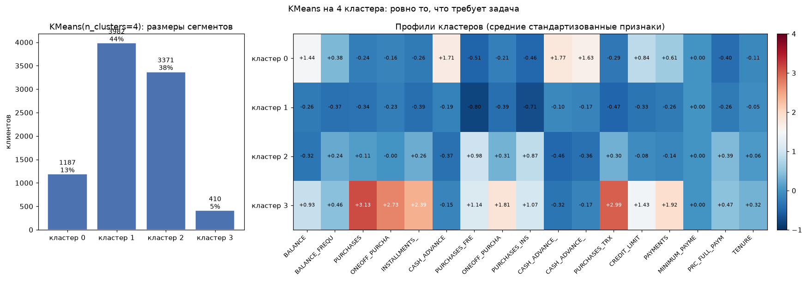

# Анализ клиентов кредитных карт

Сегментация 8950 держателей кредитных карт из датасета CC GENERAL без меток. Задача требует разделить базу **ровно на 4 кластера**, и в этом проекте исходное решение этому требованию не отвечает. Ниже разбор, что получилось на самом деле и что делает требование выполнимым.

| | Значение |
|---|---|
| Требование задачи | ровно 4 кластера |
| Исходное решение | DBSCAN(eps=0.9, min_samples=12) |
| Фактически кластеров | 5 |
| Выбросы | 47.3% (4235 из 8950) |
| Рабочая замена | KMeans(n_clusters=4), CH 1737 |

## Что за данные

17 числовых колонок, все уже агрегированы до поведенческих характеристик:

* `BALANCE`, `BALANCE_FREQUENCY`, остаток на счёте и как часто он менялся
* `PURCHASES`, `ONEOFF_PURCHASES`, `INSTALLMENTS_PURCHASES`, суммы покупок, разовые и в рассрочку
* `CASH_ADVANCE`, `CASH_ADVANCE_FREQUENCY`, `CASH_ADVANCE_TRX`, снятие наличных и частота
* `CREDIT_LIMIT`, `PAYMENTS`, `MINIMUM_PAYMENTS`, `PRC_FULL_PAYMENT`, лимит и платежи
* `TENURE`, срок владения картой в месяцах
* ещё четыре колонки частот покупок

Пропусков всего два вида: 313 в `MINIMUM_PAYMENTS` и один в `CREDIT_LIMIT`. Первые заполнены нулями, потому что отсутствие минимального платежа означает, что его не было; лимит заполнен медианой.

## EDA

Сделан `pairplot` по всем признакам, распределения каждой колонки и boxplot. Главное, что видно по распределениям: почти в каждой колонке тяжёлый правый хвост. У `BALANCE` медиана 873 при среднем 1564, `CASH_ADVANCE` у большинства нулевой. Это разнородная аудитория, где есть массовый «нормальный» клиент и небольшая группа с оборотами на порядки выше.

## Подбор параметров в исходном решении

Сначала все колонки стандартизированы по отдельности через `StandardScaler`. Кластеризация в таком масштабе единственный осмысленный вариант, иначе признаки с большим разбросом просто раздвинут пространство.

Дальше перебором прошёлся по сетке `eps` от 0.1 до 2.5 с шагом 0.05 (48 значений) и `min_samples` от 10 до 20 (11 значений), всего 528 комбинаций. Для каждой считались число кластеров и доля шума. Критерий отбора: больше 3 кластеров и доля шума в диапазоне 45...55%. Половина точек как выбросы для DBSCAN на таких данных норма, но уходить в 80% шума значит выкинуть всю выборку.

Из подходящих комбинаций взята `eps=0.9`, `min_samples=12`.

## Что получилось на самом деле

```python
df['CLUSTER'].unique()   # array([ 0, -1,  1,  3,  4,  2])
```

Метки от 0 до 4 плюс шум, то есть **кластеров пять, а не четыре**. В markdown-ячейке ноутбука написано «получилось 4 кластера (от 0 до 3)», но это не так, и markdown с кодом расходится.



Распределение по размерам такое:

| | размер | доля |
|---|---|---|
| Кластер 0 | 4656 | 52% |
| Выбросы (-1) | 4235 | 47.3% |
| Кластер 1 | 23 | 0.3% |
| Кластер 2 | 16 | 0.2% |
| Кластер 3 | 8 | 0.1% |
| Кластер 4 | 12 | 0.1% |

То есть содержательной сегментации не вышло. Есть один большой кластер, половина данных помечена как шум и четыре микрокластера по 8-23 точки. Причина в том, что на 17 стандартизованных признаках данные образуют по сути одну плотную массу, а плотностные методы на ней не работают.

## Метрики посчитаны неверно

В ячейке с силуэтом передаётся `df[mask]`, а к этому моменту в `df` уже добавлена колонка `CLUSTER`, то есть **метка кластера попадает в признаки**. На этих данных силуэт 0.341 и CH 71.63, а по 17 исходным признакам на тех же метках 0.200 и 57.2.

Числа в markdown-ячейках ноутбука (0.391 и 80.91) не совпадают ни с тем, ни с другим: похоже, они переписаны руками и ни разу не выводились.

## Что отвечает требованию задачи

DBSCAN вообще не принимает k как параметр, число кластеров тут не задаёшь, а получается сколько вышло. Проверил варианты, где k задаётся явно:

| Алгоритм | размеры кластеров | Silhouette | CH |
|---|---|---|---|
| DBSCAN(0.9, 12) | 4656 + три по 8-23 | 0.200 | 57.2 |
| **KMeans(4)** | 3982, 3371, 1187, 410 | 0.205 | **1737** |
| Agglomerative(4) | 4526, 3185, 1216, 23 | 0.181 | 1362 |



KMeans даёт ровно 4 сегмента сопоставимого размера и Calinski-Harabasz 1737 против 57, то есть на порядок лучше разделение. Профили при этом читаются:

* **кластер 0**, 3982 клиента: высокий `BALANCE`, `CASH_ADVANCE` +1.71, `CASH_ADVANCE_FREQUENCY` +1.77. Снимают наличные и держат высокий остаток.
* **кластер 1**, 3371 клиента: всё ниже среднего, покупок мало. Тихие держатели, карта почти не используется.
* **кластер 2**, 1187 клиентов: покупки в рассрочку +0.87 и `PURCHASES_FREQUENCY` +0.98. Активны, но через рассрочку.
* **кластер 3**, 410 клиентов: `PURCHASES` +3.13, `ONEOFF_PURCHASES` +2.73, `PURCHASES_TRX` +2.99, `PAYMENTS` +1.92. Транзакционные, расплачиваются полностью.

## Ограничения

* Исходный ноутбук я не переписывал. Замена DBSCAN на KMeans здесь означала бы пересборку всего блока с перебором 528 комбинаций, а это уже другая задача. В конец добавлен блок проверки, который воспроизводит и исходный результат, и решение на 4 кластера.
* Даже у KMeans силуэт всего 0.205. Это честная цифра для таких данных: 17 признаков, из которых часть вырождена (`MINIMUM_PAYMENTS` после заполнения нулями становится константой), а остальные сильно коррелируют между собой. Идеальной сегментации тут ждать не от чего.
* Перед кластеризацией стоило снизить размерность через PCA до 5...10 компонент. На 17 признаках расстояния концентрируются около среднего, и это одна из причин, почему плотностные методы сходят к одному большому кластеру плюс шум.
* Ручная разметка выборки в 200...300 строк отделила бы аномалии от плотного ядра «нормальных» клиентов вокруг нулевых покупок.
* `MINIMUM_PAYMENTS` заполнено нулём сразу для всех строк, колонка вырождается в признак «есть ли значение». Логичнее было оставить пропуск как отдельную категорию.
* `kagglehub` в первой ячейке закомментирован, датасет лежит рядом файлом.

## Запуск

`CC_GENERAL.csv` рядом с `clustering.ipynb`, ячейки по порядку. Нужен `plotly` для 3D проекции и `tqdm` для прогресс-бара в переборе параметров, оба есть в `requirements.txt`.