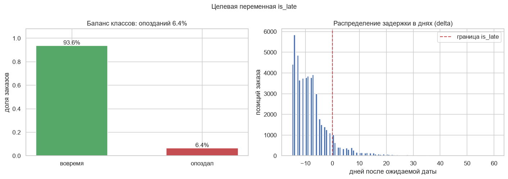
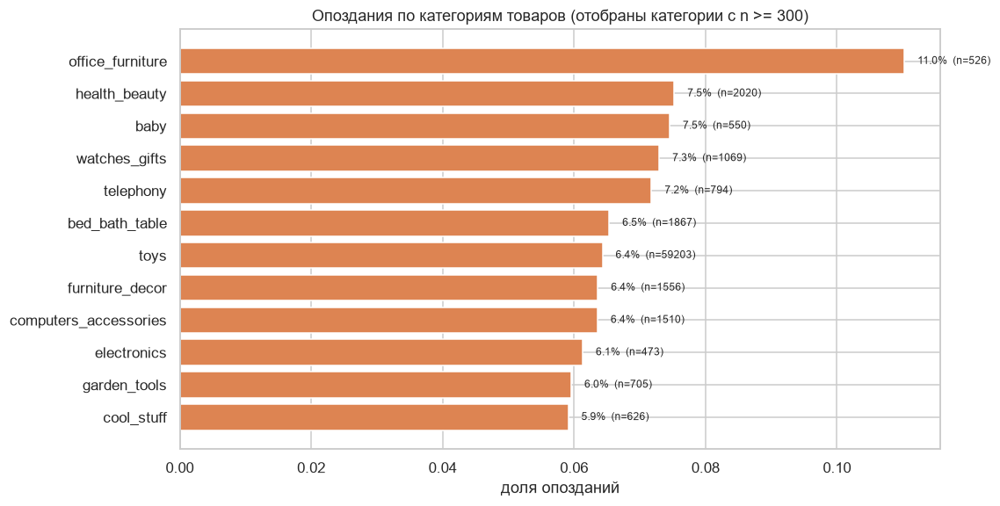
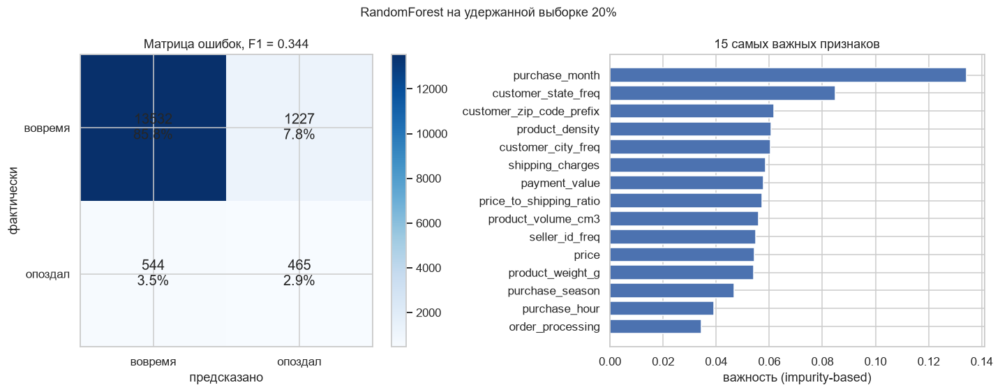
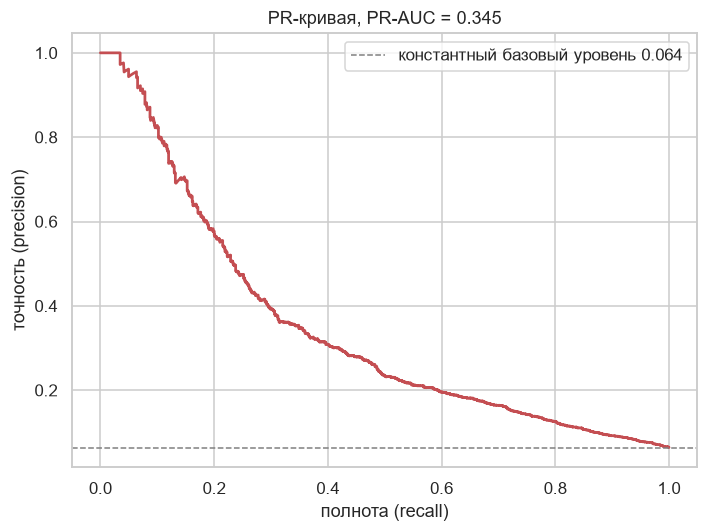

# Предсказание задержек доставки транспортной компании

Задача на данных бразильского маркетплейса Olist: по истории заказов предсказать бинарный признак `is_late`, то есть доставлен ли заказ позже ожидаемой даты. Целевая метрика из ТЗ: F1, порог 0.3.

| | Значение |
|---|---|
| Метрика | F1 = 0.3255 (порог 0.3) |
| Модель | RandomForestClassifier |
| Результат | 8558 строк в `result.csv` |

## Почему метрика такая низкая

Опоздаёт 6.4% позиций заказа (5044 из 78 840). Даже идеальная модель, всегда предсказывающая «не опоздал», даст F1 около 0.11. Чтобы набрать 0.3, нужно поймать часть опозданий, не уйдя в полноту предсказания «опоздал» для всех. Отсюда и `class_weight='balanced'`: без него случайный лес на таком дисбалансе просто предсказывает нули.

## Данные

В train 80 758 строк и 23 колонки. Первым шагом оставил только `order_status == 'delivered'`: для отменённых и недоставленных заказов факт опоздания не определён в принципе, и они только шумят. После фильтра и `dropna()` остаётся 78 840 строк. Пропуски в `product_category_name` заполнил значением `'other'`.

Целевая метка собирается из разницы между фактической и ожидаемой датами доставки. Если `delta <= 0`, заказ вовремя. Медианная задержка равна минус 13 дням, то есть чаще всего товар приезжает на две недели раньше обещанного, а опоздавшихся единиц меньше.



Слева видно, насколько всё смещено: опозданий 6.4%. Из-за этого accuracy и не показательна, модель, всегда предсказывающая «вовремя», набирает 0.94. Справа распределение `delta`: медиана минус 13 дней, то есть чаще всего товар приезжает на две недели раньше обещанного, а вот опоздания начинаются только справа от нуля.



Категории с `n >= 300`, иначе в хвост попали бы группы из двух-трёх заказов, где доля скачет от нуля до единицы.

## Feature engineering

Основная работа легла на `adapt(dataset, ds_type)`, единую функцию для обоих наборов, плюс отдельная `add_frequency_encoding(train_df, test_df, column)` для категорий.

Частотное кодирование вместо one-hot применил к четырём колонкам с огромной кардинальностью: `customer_state`, `customer_city`, `seller_id`, `product_category_name`. Идея в том, что для классификатора важен не конкретный город, а насколько часто он встречается как хаб заказов. Значения, не встретившиеся в train, кодируются нулём.

Производные признаки:

| Признак | Как считается |
|---|---|
| `items_in_order` | размер группы по `order_id` |
| `purchase_month`, `purchase_season` | месяц и сезон из `order_purchase_timestamp` |
| `purchase_dayofweek`, `purchase_is_weekend` | день недели, 1 в субботу и воскресенье |
| `purchase_hour` | час оформления |
| `price_to_shipping_ratio` | цена / (стоимость доставки + 1) |
| `order_processing` | часы между покупкой и подтверждением заказа |
| `product_volume_cm3` | произведение трёх габаритов товара |
| `product_density` | вес / объём |

Логика была простая: задержка чаще зависит от загрузки склада и сезонности, чем от цены. Поэтому сезон, день недели и скорость обработки заказа дали больше сигнала, чем любые сырые поля продавца. Плотность товара тоже пригодилась: тяжёлая и объёмная посылка едет дольше.

`payment_type` разложен в один-hot (`is_credit_card`, `is_wallet`, `is_voucher`, `is_debit_card`) прямо в коде, потому что значений мало и словарь получается читаемым. Из колонок удалены `order_status` (везде `delivered`), а также `order_id`, `customer_id`, `product_id` как почти уникальные идентификаторы.

Порядок колонок теста принудительно приводится к порядку train:

```python
train_columns = X_train.columns.tolist()
X_test = X_test[train_columns]
```

Без этой строки `RandomForest` падает с ошибкой о несовпадении числа признаков.

## Модель

```python
model = RandomForestClassifier(100, min_samples_leaf=4, max_depth=15,
                               random_state=42, class_weight='balanced')
```

Глубина 15 ограничивает переобучение на 20 числовых признаках, `min_samples_leaf=4` не даёт выделять листья из двух-трёх объектов, а `class_weight='balanced'` перевешивает редкий положительный класс. Случайный лес выбрал потому, что не требует масштабирования, спокойно относится к выбросам в суммах покупок и сразу даёт `feature_importances_`.

Итог: F1 = 0.3255 при пороге 0.3, `result.csv` на 8558 строк.

## Просто проверить себя

В ноутбуке модель обучена на всём train, потому что тестовые данные закрыты и метрику посчитать не на чем. В конце ноутбука есть отдельный блок «Просто проверить себя»: тот же пайплайн на удержанной пятой части train. На `result.csv` он не влияет, его можно не запускать.

Разбиение стратифицированное, `test_size=0.2`, `random_state=42`.

| Метрика | Значение |
|---|---|
| F1 | 0.3443 |
| ROC-AUC | 0.7942 |
| PR-AUC | 0.3451 |
| Accuracy | 0.8877 |
| Precision / Recall для `is_late=1` | 0.27 / 0.46 |

PR-AUC 0.3451 при базовом уровне 0.064, то есть примерно в пять раз лучше случайного. Accuracy 0.8877 вводит в заблуждение: она высокая просто потому, что 94% строк это «вовремя».



Матрица асимметрична: 465 опозданий поймано, но 1227 вовремя доставленных заказа помечены как опоздавшие. Для предупреждения клиента это скорее плюс, лишнее письмо лучше, чем молчание перед опозданием.

Справа важность признаков, и она отвечает на вопрос, ради которого затевался feature engineering: `purchase_month` с большим отрывом первый, дальше `customer_state_freq` и `customer_zip_code_prefix`. Задержку определяет сезонность и регион, а не цена товара или скорость обработки заказа, которые в хвосте списка.

Оговорка: это impurity-based оценка, на выраженных признаках она завышает вклад. Нормально проверить надо через `permutation_importance`, он в ноутбуке импортирован, но не вызван.



На таком дисбалансе accuracy обманывает, а эта кривая показывает честную картину: площадь под ней в пять раз больше базового уровня 0.064.

## Ограничения

* Кросс-валидация не проводилась, в ноутбуке одно удержанное разбиение. На 0.8 миллиона строк этого достаточно для оценки на глаз, но для устойчивой метрики нужен `StratifiedKFold`.
* Порог вероятности отсечения не подбирался, `predict` работает по умолчанию на 0.5. При precision 0.27 lowering threshold до 0.3 должен заметно поднять recall, а вместе с ним и F1.
* `permutation_importance` в ноутбуке импортирован, но не используется: на картинке выше impurity-based важность, а она на выраженных признаках завышена. Полноценная проверка требует именно `permutation_importance`.
* `PolynomialFeatures`, `train_test_split`, `MinMaxScaler` и `BinaryEncoder` тоже импортированы без дела: частотное кодирование реализовано вручную. Импорты пора прибрать.
* `customer_zip_code_prefix` осталась сырым числом среди масштабированных деревьев, хотя высококардинальна и просит frequency encoding. Судя по важности, эффект есть.
* Не попробован градиентный бустинг (`CatBoost` или `LightGBM`), который почти наверняка дал бы прирост на такой задаче с таблицей и дисбалансом.
* Точки изменения цены на маркетплейсе не использованы, хотя это сильный сигнал задержек. Они есть в исходных данных, но вырезаны вместе с датами.

## Запуск

`train.csv` и `test.csv` рядом с `case.ipynb`, ячейки по порядку, на выходе `result.csv`.