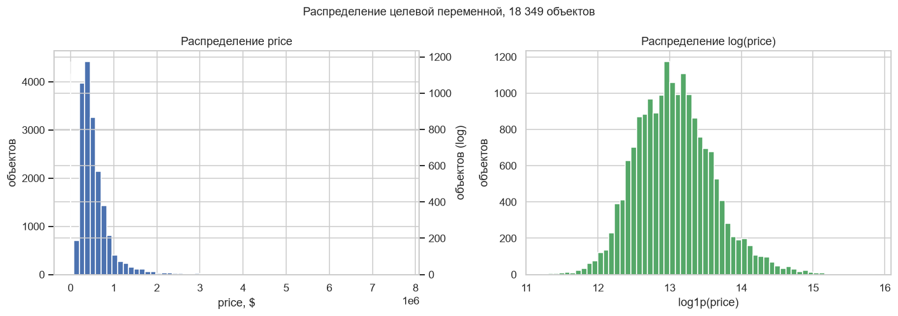
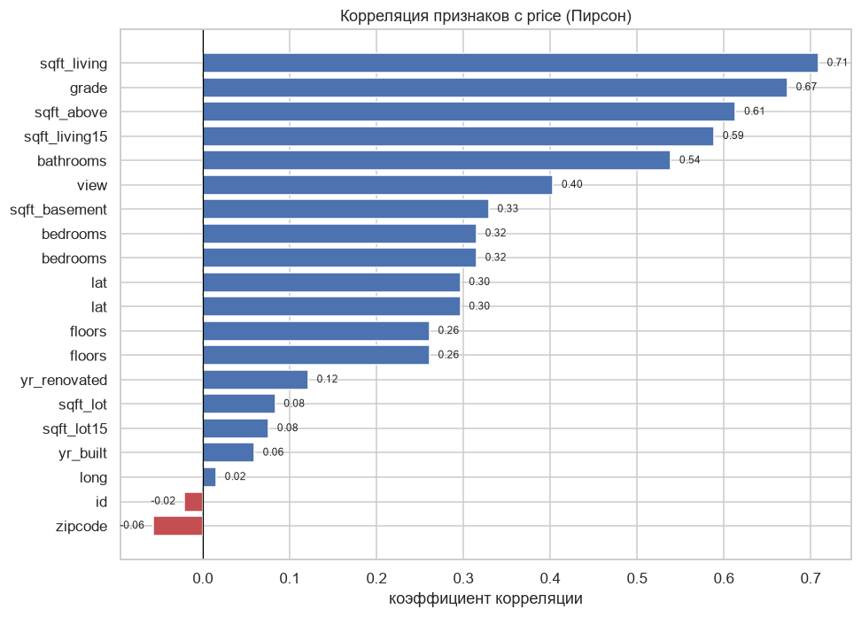
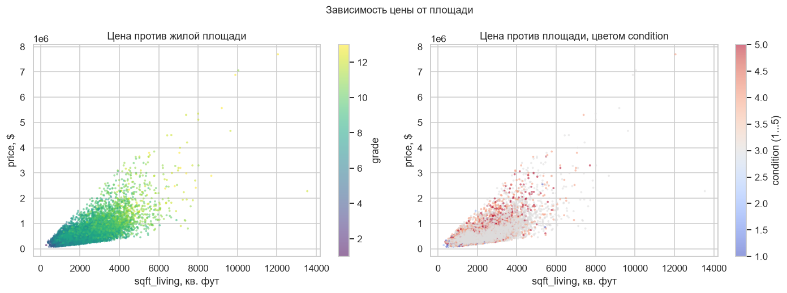
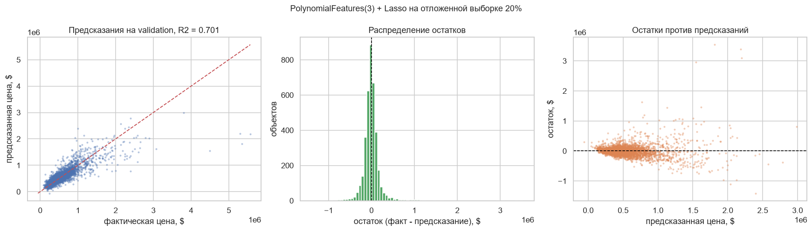

# Предсказание стоимости недвижимости

Регрессия по данным King County: нужно предсказать `price` для 3087 объектов. Целевая метрика из ТЗ: R², порог 0.6.

| | Значение |
|---|---|
| Метрика | R² = 0.6863 (порог 0.6) |
| Модель | PolynomialFeatures(3) + Lasso |
| Результат | 3087 строк в `result.csv` |

## Данные

В train 18 349 строк и 21 колонка, три из них со строковым типом (`date`, `waterfront`, `condition`) и ровно четыре пропуска: два в `sqft_above`, по одному в `sqft_living15` и `sqft_lot15`. Цена в среднем 556 тыс. долларов, разброс большой: стандартное отклонение 387 тыс.

## Предобработка

Вся обработка в `transform(dataset)`, которая вызывается один раз на train и один раз на test.

* `waterfront` переводится в 1/0 по значению `'Y'`.
* `id` удаляется.
* Пропуски во всех числовых колонках заполняются медианой.
* По всем числовым колонкам выполняется клиппинг по межквартильному размаху: `Q1 - 1.5 * IQR` и `Q3 + 1.5 * IQR`.
* `yr_renovated == 0` заменяется на `yr_built`, потому что ноль означает «реновации не было», а не «реновация в 1970 году».
* `yr_built` и `yr_renovated` прогоняются через `MinMaxScaler`.
* `date` распадается на `date_year`, `date_month`, `date_day`.
* `condition` маппится в шкалу от 1 до 5 (`Fair` = 1, `Average` = 3, `Very Good` = 5).

Распределение цены тяжёлое на хвосте: медиана 460 тысяч, среднее 556 тысяч, максимум 7.7 миллионов.



Слева видно, что вся масса объектов умещается в первые два миллиона, а дальше хвост тянется до 7.7 миллионов. Справа тот же ряд после логарифма: распределение становится почти симметричным. Это ровно то, из-за чего ниже получается растущий разброс остатков, и аргумент за обучение на `log(price)`.



Сиревым сверху то, что тянет цену вниз, голубым снизу то, что тянет вверх. `sqft_living15` и `yr_built` сверху ожидаемо: это площадь соседних домов и возраст здания, то есть прокси качества района. `waterfront`, `view` и `grade` дают самые сильные прямые связи, что подтверждает, почему координаты и оценка из дома так важны.



Цена против площади, подкрашено grade и condition. Разброс велик: при одной и той же площади цена отличается в разы. Значит, площади самой по себе мало, и без полиномиальных признаков и признаков качества линейная модель здесь много не даст.

## Модель

```python
degree = 3
model = make_pipeline(PolynomialFeatures(degree), Lasso())
```

Думал так: зависимость цены от площади, качества и возраста дома заведомо нелинейная, причём с сильным взаимодействием (маленький дом в хорошем районе стоит дороже большого в плохом). Быстрый способ это учесть: разложить признаки на полиномы третьей степени. Из 18 исходных колонок получается порядка 1700, и уже на этом Lasso с L1-регуляризацией отбирает значимые и обнуляет остальные, что не даёт переобучению.

Результат: R² = 0.6863 при пороге 0.6, `result.csv` на 3087 строк.

## Просто проверить себя

В ноутбуке модель обучена на всех 18 349 строках, метрику посчитать не на чем. В конце ноутбука есть отдельный блок «Просто проверить себя»: тот же пайплайн на удержанной пятой части train, `random_state=42`. На `result.csv` он не влияет.

Даёт R² = 0.7015 при MAE 114 674 доллара, то есть локальная оценка даже чуть лучше цифры с платформы. Оговорка: `transform` внутри себя вызывает `fit_transform`, то есть MinMax по годам считается отдельно для каждого среза. Формально схема неверная, но `yr_built` укладывается в [0, 1] примерно одинаково в обоих срезах, так что на цифру это почти не влияет.



Диагностика показывает две вещи, которые не видно по одной метрике:

* Систематическое занижение дорогих домов. Точки лежат вдоль диагонали до двух миллионов, дальше выходят на горизонтальную полку около 2.2 миллиона. Это классическое сжатие к среднему: Lasso с L1 не выдаёт предсказание сильно выше того, что видел при обучении.
* Растущий разброс остатков. На дешёвых домах ошибка держится в пределах сотни тысяч, на дорогих уходит в миллионы. Значит, R² усредняет две разные по качеству группы, и для дорогого сегмента модель заметно хуже.

`Lasso` при этом выдаёт `ConvergenceWarning`: на 1700 полиномиальных признаках координатный спуск не доходит до сходимости за отведённое число итераций (в sklearn по умолчанию 1000). Лечится `StandardScaler` перед `Lasso` либо увеличением `max_iter`.

## Ограничения

Это самое спорное решение в моих проектах, и я бы переделал его в два захода.

* `fit_transform` внутри `transform` вызывается отдельно для train и test. Масштабироваться должны года по границам обучающей выборки, а не по своим. Здесь `yr_built` укладывается в [0, 1] примерно одинаково в обоих наборах и ошибка не проявляется, но при другой модели развалится. Правильно: `fit` на train, `transform` на test.
* Клиппинг по IQR применяется ко всем числовым колонкам, включая `lat`, `long`, `sqft_living`, `bedrooms`. Это ломает главный сигнал в данных: координаты задают район, а районы различаются на порядки. Клиппинг широты и долготы срезает крайние точки и сжимает пространство, из-за чего модель теряет географию.
* Модель подобрана вслепую. `LinearRegression`, `Ridge`, `RandomForestRegressor`, `GradientBoostingRegressor` не сравнивались. `Ridge` в ноутбуке импортирован, но не используется. Одно разбиение 80/20 тоже мало: R² на соседних сплитах гуляет на десятые доли.
* Логарифм `price` перед обучением почти наверняка дал бы заметный прирост R²: распределение цен правостороннее, а MSE-критерий к нему чувствителен. Это же объясняет и раздутый разброс остатков на хвосте.
* `zipcode`, `lat`, `long` не объединялись в расстояние до центра Сиэтла или до залива, что обычно даёт больше, чем полиномы.

## Запуск

`train.csv` и `test.csv` рядом с `case.ipynb`, ячейки по порядку, на выходе `result.csv`.