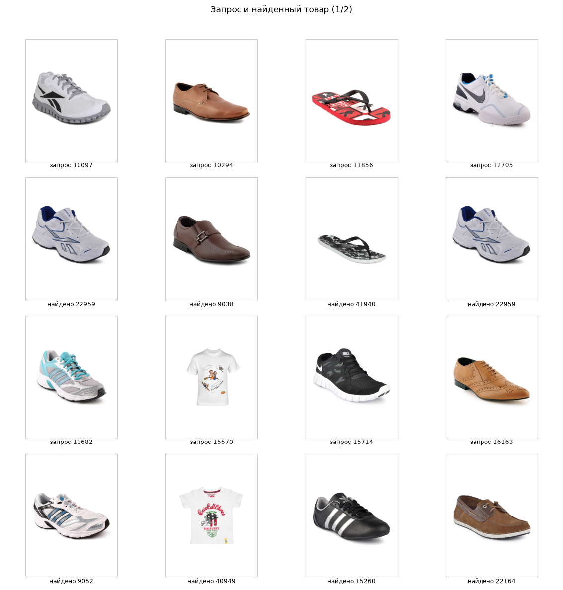
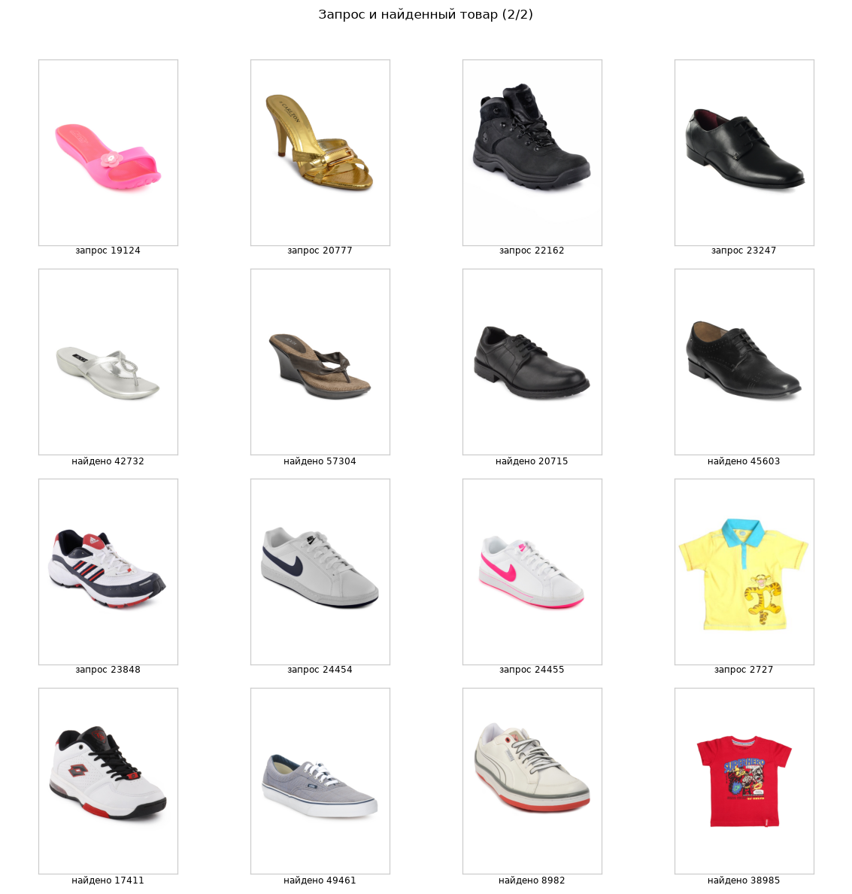

# Поиск товаров по визуальному сходству

Задача из 50 изображений одежды: для каждого запроса из `queries/` нужно найти максимально похожий товар из каталога `images/`. Метрика из ТЗ: accuracy, порог 0.7.

| | Значение |
|---|---|
| Метрика | Accuracy = 0.72 (порог 0.7) |
| Каталог | 140 изображений |
| Запросы | 50 изображений |
| Результат | 50 строк в `result.csv` |

## Идея

Дообучать CNN ради такой задачи не нужно. Предобученная на ImageNet сеть уже умеет описывать изображение вектором признаков, и близкие по стилю вещи оказываются близки в этом пространстве. Поэтому VGG16 используется как feature extractor: классификационная голова отброшена, наружу выходит 4096-мерный вектор.

```python
vgg16 = models.vgg16(pretrained=True)
vgg16.classifier = torch.nn.Sequential(*list(vgg16.classifier.children())[:-1])
vgg16.eval()
```

Координаты `lat` и `long` из предсказаний VGG16, если смотреть на архитектуру, для поиска одежды вообще ничего не значат: последние слои заточены под распознавание классов из ImageNet. Модель находит скорее «цвет и общий силуэт», чем конкретную вещь. Для fashion это слабое место, и я бы заменил VGG16 на ResNet50 или EfficientNet, обученный на apparel-датасетах.

## Пайплайн

1. Векторы признаков для всех 140 изображений каталога считаются один раз и переиспользуются для всех 50 запросов. Без кэширования получилось бы 50 повторных прогонов по каталогу.
2. Для каждого запроса считается косинусное сходство с векторами каталога через `cosine_similarity`.
3. Из результата исключается изображение с тем же ID: запросы частично пересекаются с каталогом по filename, и без этого модель возвращала бы саму себя.
4. Берётся `argmax`, ID вытаскиваются регуляркой из путей файлов.

## Подбор конфигурации

Самая интересная часть работы. В ноутбуке оставил три варианта трансформаций как эксперимент, результаты видны в комментариях:

| Конфигурация | Accuracy |
|---|---|
| Resize 224, ToTensor, Normalize | 0.66 |
| + Pad 10 reflect, RandomCrop, HorizontalFlip | 0.68 |
| + Pad 15 reflect (итоговая) | 0.72 |

Логика была такая: картинки из Fashion-MNIST-подобного набора неоднородны по кадрированию, а предмет внутри кадра может занимать разную долю. Отражение по краям перед случайным crop добавляет кадр изображения как контекст и слегка сдвигает объект, не обрезая его. Увеличение паддинга с 10 до 15 дало основной прирост.

Итог: Accuracy = 0.72, `result.csv` на 50 строк и 2 колонки (`ProductID`, `PredictProductID`).

## Как это выглядит

Первые восемь предсказаний из итогового файла, сверху запрос, снизу найденный товар:





На этих примерах видно, на что модель опирается: кроссовки находят кроссовки, шлёпки шлёпки, туфли туфли, футболки футболки. При этом срабатывает именно визуальный класс, а не конкретная вещь: белые кроссовки 10097 и 12705 обе приводят к 22959, а чёрные кроссовки 15714 уходят к чёрным Adidas 15260. То есть похожие товары в каталоге конкурируют друг с другом за один и тот же запрос, и это отдельная проблема ранжирования, которую один `argmax` не решает.

## Ограничения

* Аугментации (`RandomCrop`, `RandomHorizontalFlip`) применяются и к каталогу при извлечении векторов. Значит, векторы каталога меняются от запуска к запуску, и результат не воспроизводится. Для инференса нужен детерминированный transform, а аугментации стоит применять только при обучении.
* Точность привязана к размеру каталога в 140 изображений. При 100 тысячах товаров такой подход потребует индекса: FAISS или ANN-библиотеки, плюс кэш эмбеддингов на диске.
* Точность на одиночных изображениях без группового контекста (похожие товары, которые уже смотрели) на практике заметно ниже.
* Схлопывание запросов на один товар, видное на картинках выше. Нужен либо запрет на выдачу уже показанных товаров, либо разбиение выдачи на разнообразные группы.
* Не пробовал fine-tuning последних блоков сети и не сравнивал с CLIP или ResNet-эмбеддингами, которые в последние годы стали стандартом для image-to-image retrieval.
* Визуализация пар «запрос + найденный товар» показывается в ноутбуке, но в репозиторий не вынесена. Несколько статичных примеров в readme дали бы гораздо больше, чем сухая цифра.

## Запуск

Папки `images/` и `queries/` рядом с `CNN.ipynb`. При первом запуске VGG16 скачает веса ImageNet в кэш torchvision.