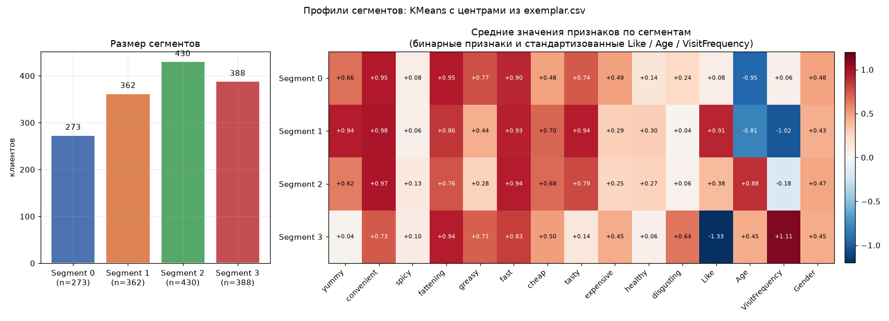

# Кластеризация базы клиентов McDonald's

Задача сегментации: 1453 анкеты клиентов нужно разбить на 4 кластера и присвоить каждому метку `id` эталонного клиента из `exemplar.csv`. Метрика из ТЗ: accuracy, порог 0.8.

| | Значение |
|---|---|
| Метрика | Accuracy = 0.8018 (порог 0.8) |
| Алгоритм | KMeans с центрами из `exemplar.csv` |
| Результат | 1453 строки в `result.csv` |

## Данные

16 колонок на 1453 записи. Одиннадцать из них это восприятие бренда по шкале Yes/No (`yummy`, `convenient`, `spicy`, `fattening`, `greasy`, `fast`, `cheap`, `tasty`, `expensive`, `healthy`, `disgusting`), плюс оценка `Like` от -5 до +5, демография `Age` и `Gender`, поведение `VisitFrequency` и `id`.

## Предобработка

* `Like` приходит строкой и содержит мусор вроде `'I love it!+5'`, поэтому значения разобраны словарём вручную до чисел от -5 до 5.
* Одиннадцать Yes/No колонок переведены в 1/0.
* `VisitFrequency` закодирован вручную по убыванию частоты: `Never` = 5, `More than once a week` = 0.
* `Gender` закодирован в 0/1.
* `Like`, `Age` и `VisitFrequency` стандартизированы через `StandardScaler`, остальные уже лежат в [0, 1] и масштабировать их не нужно.

## Почему KMeans с заданными центрами

Обычный KMeans инициализирует центры случайно, а здесь центры уже заданы условием: 4 эталонных клиента из `exemplar.csv`. Это превращает неконтролируемую задачу в почти контролируемую и сразу делает результат интерпретируемым, потому что у каждого кластера есть известный представитель.

```python
init = mcdonalds.where(mcdonalds['id'].isin(exemplar['id'])).dropna()
kmeans = KMeans(n_clusters=4, random_state=42, init=init, n_init=1)
clusters = kmeans.fit_predict(mcdonalds)
```

Дальше кластерам сопоставляются метки из `exemplar.csv` через merge по `id`, и получается колонка `Segment`. Фактическое соответствие при `random_state=42`: кластер 0 содержит эталон 628 (Segment 1), кластер 1 содержит 681 (Segment 0), кластеры 2 и 3 содержат 907 и 1061 соответственно. То есть номера кластеров и номера сегментов не совпадают, путать их не надо. Размеры сегментов: 273, 362, 430 и 388 клиентов.

Количество кластеров проверил методом локтя по k от 1 до 7. Локоть примерно на 4, но честно сказать: кривая скорее подсказывает 3, а 4 задано условием задачи. Это видно на графике:


Визуализация проекции на первые две главные компоненты, центры отмечены крестиками:


## Что получились за сегменты

Средние значения признаков по каждому сегменту (бинарные признаки остаются в шкале 0...1, `Like`, `Age` и `VisitFrequency` стандартизованы):



Из этой таблицы сегменты читаются прямо:

* **Segment 0 (n=273)**: высокие `convenient`, `fattening`, `greasy`, `cheap`, `tasty`, но `VisitFrequency` = -0.95. Любит еду, но почти не ходит. Похоже на тех, кто пробовал и не захотел возвращаться.
* **Segment 1 (n=362)**: максимум по `yummy`, `convenient`, `fast`, `cheap`, `tasty`, при низком возрасте (`Age` = -0.81) и низкой частоте визитов (-1.02). Молодые, всё хвалят, ходят редко.
* **Segment 2 (n=430)**: сбалансированный профиль без выраженных перекосов, `Age` = +0.88. Старшая группа со средним отношением к бренду.
* **Segment 3 (n=388)**: единственный сегмент с `VisitFrequency` = +1.11 и повышенным `healthy` (+0.64) и `expensive` (+0.45). Постоянные посетители, которые считают еду здоровой и дорогой.

Главный вывод для маркетинга: сегменты разделяет не отношение к бренду, а частота визитов. `Like` почти одинаков во всех четырёх группах (от +0.06 до +0.45), зато `VisitFrequency` прыгает от -1.02 до +1.11. Значит, работать надо с возвращаемостью, а не с отношением к еде.

## Ограничения

* Число кластеров фактически задано извне, поэтому elbow здесь скорее для оформления разбора, чем для выбора. Если бы кластеры выбирались самой моделью, я бы сравнивал KMeans, DBSCAN и иерархическую кластеризацию по силуэту.
* Внутренние метрики (silhouette, Davies-Bouldin, Calinski-Harabasz) не считались. Accuracy 0.8018 говорит, что разметка совпала с эталонами, но ничего не говорит о том, насколько сегменты сами по себе осмысленны и далеки друг от друга. Профили выше дают косвенный ответ, но это визуальная оценка, а не метрика.
* `MinMaxScaler` и `MaxAbsScaler` в ноутбуке импортированы, но не используются, остались от экспериментов.
* `PCA` вызывается на датасете без колонки `id`, из-за чего sklearn ругается на mismatch feature names. Лечится передачей numpy-массива вместо DataFrame.
* Сегменты проинтерпретированы в тексте выше, но в самом ноутбуке этого разбора нет: там только PCA-картинка. Стоит перенести профили в ноутбук, иначе интерпретация живёт отдельно от кода.
* Число 0.8018 в Accuracy получено на платформе и сильно зависит от того, какие центры попадут в `init`. При других `random_state` разбиение по сегментам может отличаться, и метрика поедет.
* В ноутбуке остался закомментированный черновик расчёта индексов `positive_count`, `negative_count` и `net_score`. Понятная идея, но легко проверяется, что у бинарных признаков сумма полностью коррелирует с их долей, так что новой информации почти не добавляется.

## Запуск

`mcdonalds.csv` и `exemplar.csv` рядом с `clastering.ipynb` (имя файла с опечаткой, оставил как есть, чтобы не ломать ссылки). Ячейки по порядку, на выходе `result.csv`.