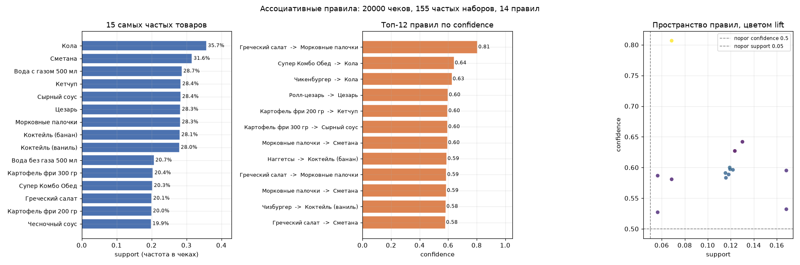

# Товарные рекомендации на основе ассоциативных правил

Задача без учителя на логе чеков фастфуда: для 11 товаров из `test.csv` нужно предложить сопутствующий. Метрика из ТЗ: accuracy, порог 0.6.

| | Значение |
|---|---|
| Метрика | Accuracy = 0.909 (10 из 11 верно) |
| Алгоритм | Apriori + правила ассоциации |
| Результат | 11 строк в `result.csv` |

## Данные

В `fastfood_transactions.csv` 97 152 строки, которые сводятся к 20 000 чекам и всего 20 уникальным товарам. Узкий ассортимент и крупные чеки (в среднем почти 5 позиций) означают, что Apriori отрабатывает быстро и находит много правил.

Разбор структуры чека такой:

```python
transactions = df.groupby('transaction_id')['item_name'].apply(list).tolist()
```

Дальше `TransactionEncoder` превращает список списков в бинарную матрицу, и уже к ней применяется `apriori` с `min_support=0.05`, после чего `association_rules` с порогом `confidence=0.5`. Порог 0.05 отсёк длинные хвостовые наборы и оставил 155 частых наборов, из которых прошли 14 правил.



На графике видно проблему с порогами: почти все точки стоят в левом верхнем углу, то есть при невысокой поддержке confidence держится около 0.5-0.6. Правила вида «взял X, часто брал Y» в фастфуде в основном описывают то, что и так очевидно: к бургеру идут напитки, к картофелю фри идут соусы. Полезность таких правил для среднего чека сомнительна, нужны правила с `lift` заметно выше единицы.

## Логика предсказания

```python
def find_expected_item(item):
    for idx, row in rules.iterrows():
        if item in row['antecedents'] and len(row['antecedents']) == 1:
            return list(row['consequents'])[0]
    # иначе берём правило с максимальной confidence
```

Сначала ищется правило, где товар выступает единственным антецедентом, то есть прямое правило вида «купил X, значит рекомендуем Y». Только если такого нет, перебираются составные антецеденты и выбирается правило с наибольшей `confidence`. Если не нашлось ничего, возвращается «Кола» как безопасный проходной вариант, она продаётся во всех чеках.

Примеры результата: Чизбургер -> Коктейль (ваниль), Греческий салат -> Морковные палочки, Наггетсы -> Коктейль (банан).

## Ограничения

* Accuracy 0.909 на 11 товарах это 10 из 11, то есть одна ошибка. Такая выборка слишком мала, чтобы по ней судить о качестве модели: любой сдвиг на один товар меняет метрику на 0.09. Считать надо на полном размеченном логе, разбив чеки на train и test.
* Пороги 0.05 и 0.5 подобраны на глаз, и график выше показывает, что они дают в основном тривиальные правила. Фильтровать надо по `lift`, иначе в выдачу попадают популярные товары вроде колы, которые и так покупают все.
* Рекомендация одна на товар. В реальной корзине обычно показывают топ-3...5, причём с учётом уже выбранных позиций, чтобы не предложить пять коктейлей подряд.
* Fallback «Кола» захардкожен строкой. Лучше брать самый частый товар из обучающей выборки.
* Импортирован `pyfpgrowth`, но не используется. Для 97 тысяч строк есть смысл сравнить с FP-Growth: у Apriori заметно хуже асимптотика по длине наборов.
* Разбор метрик (`support`, `confidence`, `lift`) добавлен только в этот readme, в ноутбуке его нет.

## Запуск

`fastfood_transactions.csv` и `test.csv` рядом с `assosiation_rules.ipynb`, ячейки по порядку, на выходе `result.csv`.