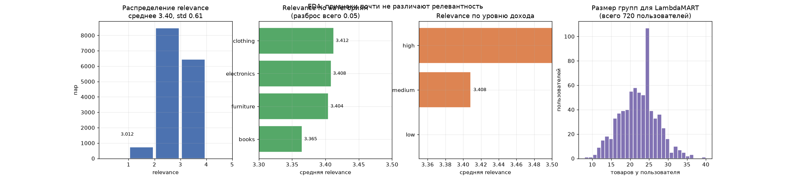

# Рекомендательная система для интернет-магазина

Задача learning to rank: для каждой пары «пользователь, товар» нужно предсказать `relevance` от 1 до 5 так, чтобы товары с высокой оценкой оказались выше в выдаче. Метрика из ТЗ: NDCG@5, порог 0.9.

| | Значение |
|---|---|
| Метрика | NDCG@5 = 0.9464 (порог 0.9) |
| Модель | XGBoost `rank:ndcg` (LambdaMART) |
| Результат | 3993 строки в `submission.csv` |

## Что отличает ранжирование от обычной классификации

Обучающая выборка это 16 007 пар и 720 пользователей, в среднем 22 товара на человека. Оценка зависит не от отдельной пары, а от того, насколько хорошо весь блок товаров одного пользователя отсортирован. Поэтому метрика NDCG@5 и функция потерь `rank:ndcg` работают с группами: XGBoost получает не просто матрицу, а размеры групп, и штрафует за то, что хороший товар оказался ниже плохого. Обычный регрессор, обученный на MSE, такую структуру не видит.

## Данные

| Файл | Строк | Содержимое |
|---|---|---|
| `items.csv` | 120 | `item_id`, `category`, `complexity`, `popularity` |
| `users.csv` | 900 | `user_id`, `age`, `income_level` |
| `train_interactions.csv` | 16 007 | `user_id`, `item_id`, `relevance` |
| `test_interactions.csv` | 3 993 | `user_id`, `item_id` без оценки |

Что показал EDA:

* `relevance`: среднее 3.40, стандартное отклонение 0.61, медиана 3. Оценки сжаты в узком диапазоне, сильного перекоса нет.
* Категории товаров почти равномерны: electronics 32, clothing 32, furniture 29, books 27.
* Уровни дохода: medium 478, low 241, high 181.
* Возраст от 18 до 64, средний 41.
* Корреляция `complexity` и `popularity` около нуля (-0.005), признаки независимы.
* Средняя `relevance` по категориям почти не отличается: clothing 3.41, electronics 3.41, furniture 3.40, books 3.36. То есть ни один признак сам по себе релевантность не объясняет, и основной сигнал сидит в связках «пользователь + товар».
* Количество взаимодействий на товар почти константно: от 103 до 164, на пользователя от 8 до 40. Длинных хвостов нет, группы достаточно однородны.



Картинка сводит всё вышесказанное в одну картину: распределение `relevance` сжато в 3...4, средние по категориям и уровням дохода отличаются на десятые доли, а размеры групп равномерны. Ни один доступный признак не разделяет релевантность, и это главный аргумент за то, что данные синтетические и NDCG@5 = 0.946 добывается почти без сигнала.

Именно последний пункт намекает, что данные синтетические и почти не содержат настоящего сигнала. Отсюда и такая высокая метрика: NDCG@5 = 0.9464 при пороге 0.9 достигается гораздо проще, чем на реальном логе с кликами.

## Признаки

После `merge` взаимодействий с товарами и пользователями остаётся ровно 5 признаков: `complexity`, `popularity`, `age`, закодированные `category` и `income_level`. Категории кодируются `LabelEncoder`, числа прогоняются через `StandardScaler`.

## Обучение

```python
params = {
    'objective': 'rank:ndcg',
    'learning_rate': 0.1,
    'max_depth': 6,
    'min_child_weight': 5,
    'subsample': 0.8,
    'colsample_bytree': 0.8,
    'eval_metric': 'ndcg@5',
    'seed': 42,
}
```

Разбил данные по пользователям, а не по строкам. Это ключевой момент: случайное разбиение строк отправило бы часть пар одного пользователя в train, а остальные в валидацию, и модель получала бы почти бесплатный NDCG, которого в проде не будет.

```python
val_users = np.random.choice(unique_users, size=int(0.2 * len(unique_users)), replace=False)
```

На обучение ушло 12 872 пары (576 пользователей), на валидацию 3 135 (144 пользователя). Обучение с `num_boost_round=1000` и `early_stopping_rounds=20` остановилось на 23 деревьях, лучший NDCG@5 на валидации 0.9447. Отдельно пересчитал NDCG@5 через `sklearn.metrics.ndcg_score` по группам, получилось 0.9464.

Предсказания приводятся к шкале 1...5 и округляются до целых, потому что в `submission.csv` ожидается целочисленная оценка.

## Ограничения

* `LabelEncoder` в `preprocess_data` обучается заново на каждом вызове, и для test он строится по своим значениям. Порядок категорий должен быть единым словарём из train, иначе при появлении новой категории коды сдвинутся. Сейчас уникальных значений мало и наборы совпадают, поэтому баг не проявляется.
* `StandardScaler` обучается на train и применяется к test через `transform`, это сделано правильно. Но `dtrain` создаётся на всех 16 007 парах, включая строки валидации, поэтому early stopping видит утечку. Нужно строить `dtrain` только по `train_mask`.
* П нормализации предсказаний: `(y_pred - y_pred.min()) / (y_pred.max() - y_pred.min())` считается по всему тестовому набору. Это масштабирование зависит от состава батча, и один выброс на 180 пользователей сдвинет шкалу для всех.
* Анализ ошибок в ноутбуке даёт «средняя ошибка 3.7983», что бессмысленно при шкале 1...5. Похоже, ошибка считается по группам до маски `val_mask`. Число в выводе неверное, сам анализ переписать.
* Указатель `user_id` и `item_id` выпадает из признаков. В проде для ранжирования их обычно оставлять: есть CTR по (user, item), история показов, номер позиции в прошлой выдаче. Здесь их просто нет в данных.
* Модель не пробовал на `CatBoost` с категориальными признаками, обычно он выигрывает у XGBoost на таких таблицах без ручного кодирования.

## Запуск

Четыре CSV рядом с `ranking.ipynb`, ячейки по порядку, на выходе `submission.csv`.