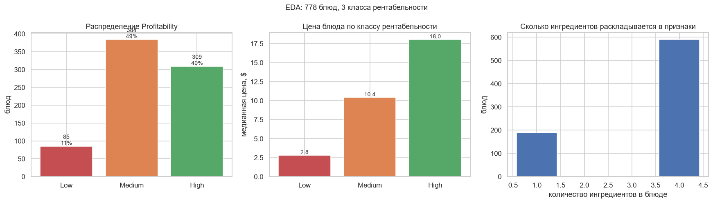
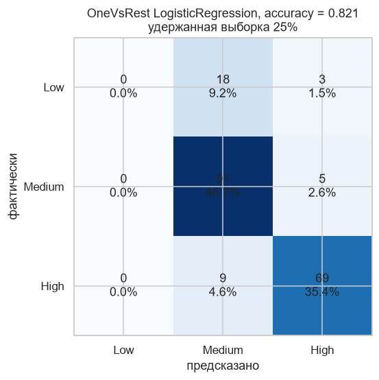

# Прогнозирование рентабельности ресторана

Классификация блюд по уровню рентабельности: `Low`, `Medium` или `High`. Метрика из ТЗ: accuracy, порог 0.75.

| | Значение |
|---|---|
| Метрика | Accuracy = 0.8154 (порог 0.75) |
| Модель | OneVsRestClassifier(LogisticRegression) |
| Результат | 195 строк в `result.csv` |

## Данные

В train 778 строк и 7 колонок, пропусков нет вообще. Кардинальность небольшая: 3 ресторана, 4 категории меню, 16 позиций, 13 ингредиентов. Именно из этих чисел и выросло решение ниже.

Самая интересная колонка `Ingredients`: это строка вида `['Tomatoes', 'Basil', 'Garlic', 'Olive Oil']`, то есть список, упакованный в строку. Написал функцию `categorial(dataset, column)`, которая разбирает такую строку и создаёт бинарную колонку на каждый уникальный элемент:

```python
def categorial(dataset, column):
    columns = dataset[column].str.replace(' ', '').str.replace('[', '')\
                             .str.replace(']', '').str.replace("'", '')\
                             .str.split(',').explode().unique()
    for item in columns:
        dataset[f'{column}_{item}'] = dataset[column].apply(
            lambda x: 1 if item in str(x).split(',') else 0)
    dataset.drop(column, axis=1, inplace=True)
```

Логику применил сразу к четырём колонкам (`RestaurantID`, `MenuCategory`, `MenuItem`, `Ingredients`), поэтому после преобразования все признаки бинарные, кроме `Price`. Именно так блюдо описывается как набор ингредиентов плюс категория, ресторан и блюдо.

Целевая переменная закодирована словарём `{'Low': 0, 'Medium': 1, 'High': 2}`, для обратного преобразования есть зеркальная функция `unmapping`.

## Модель

```python
ovr = OneVsRestClassifier(LogisticRegression())
ovr.fit(X_train, y_train)
```

Логистическая регрессия здесь естественна: бинарные признаки с физическим смыслом (есть ли в составе такой-то ингредиент) и линейная зависимость от `Price`. One-vs-Rest оборачивает её в три бинарных классификатора, по одному на класс, и итоговый ответ выбирается по максимальной вероятности.

Результат: Accuracy = 0.8154 при пороге 0.75, `result.csv` на 195 строк.

## Просто проверить себя

В ноутбуке модель обучена на всех 778 строках, метрику посчитать не на чем. В конце ноутбука есть отдельный блок «Просто проверить себя»: тот же пайплайн на удержанной четверти train. На `result.csv` он не влияет.

Accuracy получается 0.8205, но картина под ней скрывается:

| | Low | Medium | High |
|---|---|---|---|
| Precision | 0.00 | 0.77 | 0.90 |
| Recall | 0.00 | 0.95 | 0.88 |



Слева распределение классов: `Medium` 384 блюда, `High` 309, `Low` всего 85, то есть 11%. По центру медианная цена по классам, и видно, что `Low` это в основном дешёвые блюда, так что модель частично могла бы ловить его по одной цене, но не ловит. Справа сколько ингредиентов разворачивается в бинарные признаки, их всего 13.



Первый столбец целиком нули: ни один объект класса `Low` модель не распознала, все 21 ушли в `Medium` или `High`. При этом accuracy 0.82, потому что два других класса предсказываются хорошо.

Это ровно тот случай, когда accuracy врёт. Accuracy 0.82 при macro F1 = 0.58, и разрыв показывает, что треть данных модель не различает вообще. Причина в том, что `Low` это 85 блюд из 778, а One-vs-Rest без `class_weight` оптимизирует суммарную ошибку и просто игнорирует редкий класс.

## Ограничения

* В исходном решении валидации не было, `train_test_split` импортирован, но не вызывался. Блок проверки в конце ноутбука я добавил отдельно.
* Нужен `class_weight='balanced'` или сбалансированный сэмплинг, иначе `Low` останется нераспознанным. Ещё честнее перейти на macro F1 как на целевую метрику.
* Признаки `MenuItem`, `RestaurantID` и `MenuCategory` закодированы one-hot так же, как ингредиенты, и модель выучивает «блюдо X всегда High» вместо связи с составом. Для проверки бизнес-логики эти колонки стоило бы выкинуть и оставить только ингредиенты плюс `Price`.
* Всего 13 ингредиентов и 16 блюд на 778 строк: данных мало, и модель скорее запоминает, чем обобщает.
* Регрессия вместо классификации была бы оправданнее: рентабельность блюда это число, а не категория, и `Profitability` наверняка квантилизован из непрерывного показателя. Границы классов тогда были бы предсказуемыми.
* Из кодирования не убраны пропуски на строковых колонках. Сейчас все значения известны заранее, но при появлении нового блюда в тесте набор бинарных колонок разойдётся с обучением, и `X_test` придётся выравнивать вручную.

## Запуск

`train.csv` и `test.csv` рядом с `case.ipynb`, ячейки по порядку, на выходе `result.csv`.