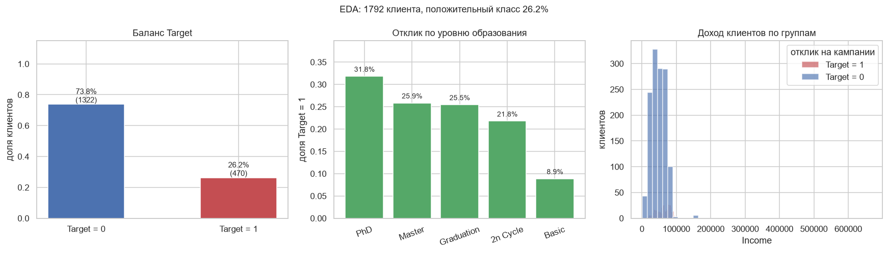
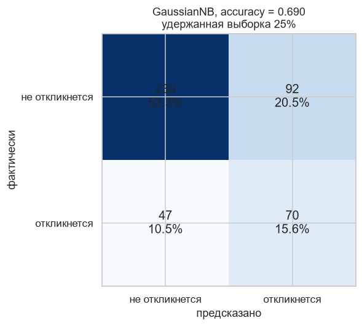

# Таргетированный маркетинг: предсказание отклика на кампании

Классическая задача с соревнования по маркетингу: для каждого клиента нужно предсказать, примет ли он хоть одно предложение из рекламных кампаний. Метрика в ТЗ не задана, поэтому акцент здесь на самом пайплайне и на разборе признаков, а не на выкручивании последнего процента качества.

## Данные

`train.csv` (1792 строки, 29 колонок) и `test.csv` (448 строк, 23 колонки). В train есть шесть бинарных колонок с откликом на кампании: `AcceptedCmp1`...`AcceptedCmp5` и `Response`. В test их нет, и именно по ним предсказывается `Target`.

Пропуски только в `Income`: 19 значений в train и 5 в test. Категориальные колонки три: `Education` (5 значений), `Marital_Status` (8 значений, включая `YOLO` и `Absurd`) и `Dt_Customer`.

## Что делал

Целевая переменная собирается как сумма шести бинарных колонок с последующей бинаризацией:

```python
train['Target'] = (train['AcceptedCmp1'] + train['AcceptedCmp2'] +
                   train['AcceptedCmp3'] + train['AcceptedCmp4'] +
                   train['AcceptedCmp5'] + train['Response']).apply(lambda x: 1 if x > 0 else 0)
```

Дальше вся предобработка собрана в одну функцию `prepare(dataset, key)`, которая одинаково применяется к train и test. Это важно: раздельная обработка двух наборов почти всегда приводит к рассинхрону колонок на predict.

* `Education` переводится в порядковую шкалу от 0.1 до 0.9 (`Basic` = 0.1, `PhD` = 0.9).
* `Marital_Status` получает аналогичную шкалу от 0.0 до 0.5, причём `YOLO` и `Absurd` схлопнуты в 0.0 как отсутствие семейного положения.
* `Dt_Customer` удаляется. Дата регистрации в задаче про отклик на текущие кампании ничего не объясняет, а кодировать её одним числом я не стал.
* Пропуски `Income` заполняются медианой.
* Все числовые колонки, кроме `ID`, прогоняются через `MinMaxScaler` в диапазон [0, 1].
* Перед возвратом из функции у train выкидываются колонки `AcceptedCmp1`...`AcceptedCmp5`, `Response` и `Target`, иначе получится утечка цели.

Баланс классов: положительных 470 из 1792, то есть 26.2%. Умеренный дисбаланс, отдельная техника для него не понадобилась.

## Модель

`GaussianNB()` с параметрами по умолчанию (`var_smoothing=1e-9`). Выбрал её по двум причинам: после `MinMaxScaler` почти все признаки лежат в [0, 1] и распределены достаточно гладко, поэтому гауссово предположение работает; и модель обучается за секунды, что позволило спокойно прогнать пайплайн несколько раз, не тратя время на подбор гиперпараметров.

Итог: `result.csv`, 448 строк и 2 колонки (`ID`, `Target`).

## Ограничения

Здесь я сделал меньше, чем в остальных проектах, и это стоит назвать прямо:

* В исходном решении валидации не было, метрика в ТЗ тоже не задана. Блок проверки в конце ноутбука я добавил отдельно.
* `var_smoothing` и альтернативные модели (градиентный бустинг, SVM с RBF-ядром, ансамбль из линейной модели и KNN) не сравнивались. Логистическая регрессия на этих данных, скорее всего, дала бы сопоставимый результат, а `RandomForestClassifier` с `class_weight='balanced'` забрал бы часть ошибок на дисбалансе.
* Порядковое кодирование `Education` шкалой 0.1...0.9, а затем `MinMaxScaler` поверх, это двойное кодирование одной и той же упорядоченной переменной. Работает, но масштабировать её второй раз незачем.
* `prepare` вызывает `fit_transform` отдельно для train и test. Для MinMax это утечка: тест нормализуется по своим границам, а не по обученным. Сейчас на результат это почти не влияет, но при смене модели на чувствительную к масштабу схему сломается.
* Из импортов не используется `train_test_split`, а `fetch_openml` остался от копипасты заготовки.

## Просто проверить себя

В ноутбуке модель обучена на всём train без разделения. В конце ноутбука есть отдельный блок «Просто проверить себя»: та же логика на удержанной четверти train, стратифицированное разбиение, `random_state=42`. На `result.csv` он не влияет.

| Метрика | Значение |
|---|---|
| Accuracy | 0.6897 |
| ROC-AUC | 0.7286 |
| F1 для `Target=1` | 0.5018 |
| Precision / Recall для `Target=1` | 0.43 / 0.60 |



Слева баланс: `Target = 1` это 26.2%, дисбаланс умеренный, специальных техник балансировки не требовалось. По центру отклик по образованию, и разброс заметный: у `PhD` и `Graduation` он выше всего. Справа распределение дохода внутри двух групп, и оно почти совпадает, то есть признак `Income` с его пропусками и медианным заполнением работает вхолостую.



Модель ловит 60% откликнувшихся, но 43% её положительных прогнозов ошибочны. Для маркетингового бюджета это плохая сделка: скидка отправляется почти половине тех, кто всё равно не купит. Нужен либо более жёсткий порог отсечения с упором на precision, либо другая модель.

## Запуск

`train.csv` и `test.csv` кладутся рядом с ноутбуком `case.ipynb`, после чего ячейки выполняются по порядку. На выходе появляется `result.csv`.